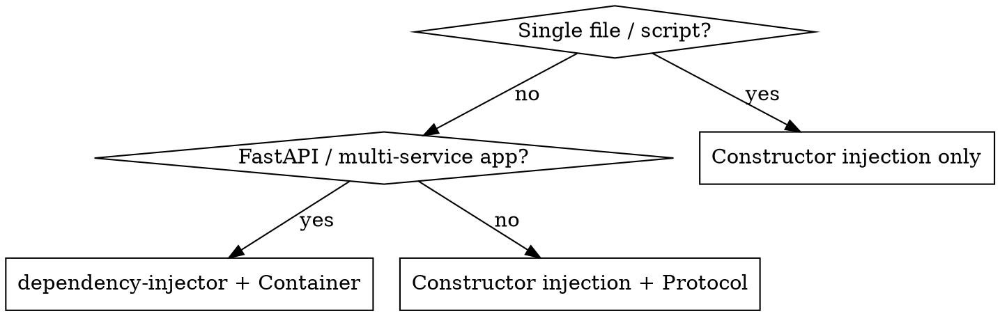

# Dependency Injection — Python

## Overview

**"Give me what I need, don't make me create it yourself."**

A class that instantiates its own dependencies is tightly coupled to them — hard to test, hard to swap, hard to reason about. DI moves object construction out of the class and into a dedicated layer (the container), so the class only declares what it needs.

## The Problem

```python
# ❌ Tightly coupled — can't test without a real database
class DocumentClassifier:
    def __init__(self) -> None:
        self.db = PostgreSQLClient(host="localhost", password="secret")  # hardwired
        self.llm = OllamaClient(model="phi4-mini")                       # hardwired

# ✅ Loosely coupled — caller decides the implementation
class DocumentClassifier:
    def __init__(self, db: DocumentRepository, llm: LLMClient) -> None:
        self.db = db
        self.llm = llm
```

---

## Step 1 — Constructor Injection (pure Python)

The simplest form. No library needed. Sufficient for small scripts and single-file modules.

```python
# Construct dependencies outside the class, pass them in
db = PostgreSQLClient(host=settings.DB_HOST)
llm = OllamaClient(model="phi4-mini")
classifier = DocumentClassifier(db=db, llm=llm)
```

---

## Step 2 — Add Abstractions (Protocol)

Define the interface the class depends on, not the concrete type.
This makes swapping implementations (real → fake → mock) a one-line change.

```python
from typing import Protocol

class LLMClient(Protocol):
    def complete(self, prompt: str) -> str: ...

class DocumentRepository(Protocol):
    def save(self, doc: dict) -> None: ...
    def exists(self, sha256: str) -> bool: ...
```

---

## Step 3 — `dependency-injector` Container (for FastAPI / larger apps)

For applications with many services, use `dependency-injector` to manage construction
in one place. This is the pattern used in this project.

### Install

```bash
uv add dependency-injector
```

### Directory layout

```
src/<package>/
├── injections/
│   ├── __init__.py      # configure_container() — wired once, cached
│   ├── production.py    # Container with real providers
│   └── test.py          # TestContainer for overrides
├── api/
│   ├── dependencies.py  # Annotated type aliases for FastAPI Depends()
│   └── routes/
│       └── predict/
│           └── endpoints.py  # @inject handlers
└── settings.py          # Pydantic BaseSettings singleton
```

### `injections/production.py` — declare providers

```python
from dependency_injector import containers, providers
from app.services import ClassificationService, IngestionService

class Container(containers.DeclarativeContainer):
    # Factory → new instance per injection (stateless services)
    ingestion_service = providers.Factory(IngestionService)
    classification_service = providers.Factory(ClassificationService)

    # Singleton → one instance for the whole process (LLM model, DB pool)
    # llm_client = providers.Singleton(OllamaClient, model="phi4-mini")
```

| Provider | When to use |
|----------|-------------|
| `providers.Factory` | Stateless services — fresh instance per call |
| `providers.Singleton` | Expensive shared resources — LLM, DB pool, embedding model |
| `providers.Configuration` | Config values from env/file injected into providers |

### `injections/__init__.py` — wire once, cache

```python
from functools import cache
from .production import Container
from .test import TestContainer

@cache
def configure_container() -> Container:
    container = Container()
    container.wire(packages=["app"])   # scans all modules in "app" for @inject
    return container

__all__ = ["Container", "TestContainer", "configure_container"]
```

Call `configure_container()` at app startup (e.g. in `src/app/__init__.py`):

```python
# src/app/__init__.py
from app.injections import configure_container
configure_container()
```

### `api/dependencies.py` — Annotated aliases for FastAPI

```python
from typing import Annotated
from dependency_injector.wiring import Provide
from fastapi import Depends
from app.services import ClassificationService, IngestionService

ClassificationServiceDep = Annotated[
    ClassificationService,
    Depends(Provide["classification_service"]),
]
IngestionServiceDep = Annotated[
    IngestionService,
    Depends(Provide["ingestion_service"]),
]
```

### Route handler — `@inject` + typed parameter

```python
from dependency_injector.wiring import inject
from fastapi import APIRouter
from app.api.dependencies import ClassificationServiceDep

router = APIRouter(prefix="/classify", tags=["Classification"])

@router.post("/")
@inject                                    # ← required for dependency-injector wiring
async def classify_document(
    body: ClassificationRequest,
    service: ClassificationServiceDep,     # ← resolved by container
) -> ClassificationResponse:
    result = service.classify(body.text)
    return ClassificationResponse(category=result.category)
```

### `settings.py` — Pydantic BaseSettings singleton

```python
from pydantic_settings import BaseSettings, SettingsConfigDict
from pathlib import Path

class _Settings(BaseSettings):
    DB_HOST: str = "localhost"
    LLM_MODEL: str = "phi4-mini"
    model_config = SettingsConfigDict(env_file=".env", extra="ignore")

    @property
    def MODELS_PATH(self) -> Path:
        return Path(__file__).parent / "models"

Settings = _Settings()   # import this singleton everywhere — never re-instantiate
```

---

## Testing — Override the Container

```python
# injections/test.py
from dependency_injector import containers, providers
from tests.fakes import FakeLLMClient, FakeDocumentRepository

class TestContainer(containers.DeclarativeContainer):
    # Override only what needs replacing — rest falls through to production container
    classification_service = providers.Factory(
        ClassificationService,
        llm=providers.Factory(FakeLLMClient),
        db=providers.Factory(FakeDocumentRepository),
    )
```

```python
# tests/conftest.py
import pytest
from app.injections import configure_container
from app.injections.test import TestContainer

@pytest.fixture(autouse=True, scope="session")
def injector_override() -> None:
    container = configure_container()
    container.override(TestContainer)
    container.wire(packages=["tests"])
```

`container.override()` replaces only the providers defined in `TestContainer`.
Everything else resolves to production providers — so you only fake what matters.

---

## Common Mistakes

| Mistake | Fix |
|---------|-----|
| Instantiating a client inside `__init__` | Pass it as a parameter; let the container build it |
| Using `providers.Singleton` for stateful per-request data | Use `providers.Factory`; singletons share state across requests |
| Calling `configure_container()` more than once without `@cache` | Always wrap with `@cache` or `lru_cache(maxsize=1)` |
| Forgetting `@inject` on a route handler | Container wiring silently skips non-decorated functions |
| `container.wire(packages=["app"])` not including `"tests"` | Add `container.wire(packages=["tests"])` in `conftest.py` |
| Depending on a concrete class instead of a Protocol | Define a `Protocol`; inject the concrete implementation |

---

## Decision — Which approach?


