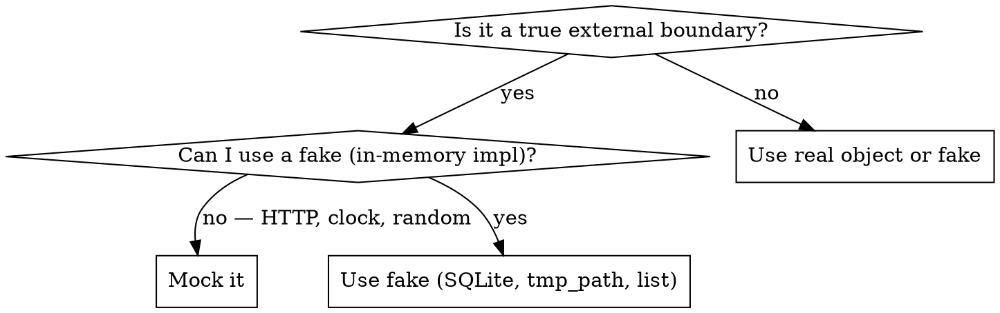

# pytest Testing

## Overview

Always use pytest. Prefer real objects and fakes over mocks. Mock only at true system
boundaries (HTTP, filesystem, clock, external APIs). Tests that use real behavior catch
more bugs and survive refactoring better than tests full of `MagicMock`.

## When to Use — Real vs Mock Decision



**True boundaries (OK to mock):** outbound HTTP calls, system clock (`datetime.now`),
hardware (GPU, camera), third-party paid APIs, non-deterministic sources.

**Not boundaries (do NOT mock):** your own classes, database when SQLite works,
file I/O when `tmp_path` works, business logic you want to verify.

## Core Patterns

### Fixtures

Fixtures provide setup/teardown as injectable dependencies. Declare them as function parameters — pytest resolves them automatically.

```python
# tests/conftest.py  ← shared fixtures for the whole test suite
import pytest
from pathlib import Path
from classiflow.ingesta.agents.agent1_file_reception import run

@pytest.fixture
def sample_pdf(tmp_path: Path) -> Path:
    """Real PDF bytes — no mock needed, tmp_path is built-in pytest fixture."""
    pdf = tmp_path / "decreto.pdf"
    pdf.write_bytes(b"%PDF-1.4 fake content for testing")
    return pdf

@pytest.fixture(scope="session")
def format_config() -> dict:
    """Load real YAML config once per session — cheap, accurate, no patching."""
    import yaml
    return yaml.safe_load(Path("config/allowed_formats.yaml").read_text())
```

**Fixture scopes** — choose the narrowest scope that avoids duplication:

| Scope | Lifetime | Use for |
|-------|----------|---------|
| `function` (default) | Each test | Mutable state, temp files |
| `module` | Each `.py` file | Read-only shared data |
| `session` | Entire run | Expensive setup (model load, DB schema) |

### parametrize — test many inputs without duplication

```python
import pytest
from classiflow.ingesta.agents.agent1_file_reception import run

@pytest.mark.parametrize("size,should_pass", [
    (0,                   False),   # empty file
    (1,                   True),    # minimal valid
    (50 * 1024 * 1024,    True),    # exactly at limit
    (50 * 1024 * 1024 + 1, False),  # one byte over
])
def test_file_size_gate(tmp_path, size, should_pass):
    f = tmp_path / "doc.pdf"
    f.write_bytes(b"x" * size)
    result = run(job_id="test", file_path=str(f))
    assert result.passed == should_pass
```

### Marks — skip, xfail, categorize

```python
# pyproject.toml — register custom marks to suppress warnings
# [tool.pytest.ini_options]
# markers = ["slow: marks tests as slow", "integration: requires real services"]

@pytest.mark.slow
def test_embedding_similarity():
    ...

@pytest.mark.integration
def test_real_db_round_trip():
    ...

@pytest.mark.xfail(reason="GPU not available in CI", strict=False)
def test_llm_inference():
    ...
```

Run subsets: `pytest -m "not slow"` · `pytest -m integration`

### conftest.py placement

```
tests/
├── conftest.py          ← fixtures available to ALL tests
├── ingesta/
│   ├── conftest.py      ← fixtures scoped to ingesta/ only
│   ├── test_agent1.py
│   └── test_agent2.py
└── extraction/
    └── test_extractor.py
```

Fixtures in a `conftest.py` are auto-discovered — no import needed.

## Fakes over Mocks

A **fake** is a real, lightweight implementation that behaves like the real thing:

```python
# Instead of mocking a hash store, use a plain dict
def test_exact_duplicate_detected(tmp_path):
    hash_store: dict[str, str] = {}          # real dict, not MagicMock
    vector_index = faiss.IndexFlatIP(384)    # real index, not mocked

    pdf = tmp_path / "doc.pdf"
    pdf.write_bytes(b"%PDF test")
    sha = hashlib.sha256(pdf.read_bytes()).hexdigest()
    hash_store[sha] = "job-original"

    result = run(
        job_id="job-duplicate",
        sha256=sha,
        text_sample="some text",
        hash_store=hash_store,
        vector_index=vector_index,
        stored_job_ids=[],
    )

    assert result.is_duplicate is True
    assert result.duplicate_type == "exact"
```

**In-memory substitutes:**

| Real dependency | Fake substitute |
|----------------|-----------------|
| PostgreSQL / SQLite | SQLite in-memory: `"sqlite:///:memory:"` |
| File system | `tmp_path` (pytest built-in) |
| Redis / hash store | `dict` |
| FAISS vector index | `faiss.IndexFlatIP(dim)` with small dim |
| LLM model | Small stub class returning fixed JSON |

## Assertions

Just use `assert`. pytest rewrites assertions to show rich diffs on failure — no need
for `assertEqual`, `assertTrue`, or `assertIsNone`:

```python
assert result.passed is True
assert result.sha256 == expected_hash
assert "Empty file" in result.reason
assert result.file_size_bytes == 0
```

## File & Naming Conventions

```
tests/
├── conftest.py
├── fixtures/               ← real fixture files (PDFs, CSVs)
│   └── decreto_sample.pdf
└── ingesta/
    ├── __init__.py
    └── test_agent1_file_reception.py   ← test_<module>.py
```

- File: `test_<module>.py`
- Function: `test_<what_it_does>_<expected_outcome>`
- One behavior per test function — short tests are easier to debug

## Running Tests

```bash
uv run pytest tests/                        # all tests
uv run pytest tests/ingesta/test_agent1.py  # one file
uv run pytest -k "duplicate"               # by name pattern
uv run pytest -m "not slow"                # by mark
uv run pytest -x                           # stop on first failure
uv run pytest -v                           # verbose output
uv run poe test                            # project alias (see pyproject.toml)
```

## Common Mistakes

| Mistake | Fix |
|---------|-----|
| Mocking your own classes | Pass the real object; redesign if it's too hard to construct |
| `scope="session"` on mutable fixtures | Mutations leak between tests — use `function` scope |
| Patching the wrong namespace | Patch where the name is **used**, not where it's defined: `patch("mymodule.os.path")` not `patch("os.path")` |
| Forgetting `__init__.py` in `tests/` | Add it; pytest needs it to resolve imports correctly |
| Giant test functions testing many things | Split into one assertion per function; parametrize instead |
| Not registering custom marks | Add to `[tool.pytest.ini_options] markers` in `pyproject.toml` |

## When Mocking Is Correct

```python
from unittest.mock import patch
import pytest

def test_agent_skips_slm_on_clear_accept(sample_pdf, format_config):
    # mock.patch is correct here: the LLM is a true external boundary
    with patch("classiflow.ingesta.agents.agent2_format_validation._slm_check") as mock_slm:
        result = run(job_id="j1", file_path=str(sample_pdf), config=format_config, llm=None)
        mock_slm.assert_not_called()   # rule-based path must not invoke the model
        assert result.recommendation == "ACCEPT"
```

Mock to **verify behavior at a boundary** — not to make a dependency easier to construct.
